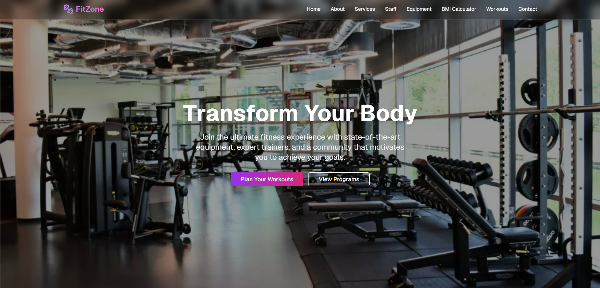

# 🏋️‍♂️ Fitzone Gym App

A **modern, responsive, and feature-rich** gym website built with **Next.js**, **React**, and **Tailwind CSS**.  
Designed for fitness enthusiasts and gym owners, Fitzone Gym App combines a sleek public site with an integrated **workout planning & tracking tool**.



---

## 🚀 Live Demo
🔗 **[View Live](https://fitzone-gym-app.vercel.app/)**

---

## ✨ Key Features

### 🖥 Modern & Responsive UI
- Fully responsive, mobile-friendly design.
- Built with **Next.js**, **React**, and **Tailwind CSS**.
- Smooth navigation and fast load times.

### 📝 Workout Planner (Built-in Todo App)
- Plan your workouts for the week.
- Mark exercises as completed.
- Tracks:
  - **Completion Rate (%)**
  - **Total Minutes Trained**
- Keeps you motivated and accountable.

### 📬 Contact Form with Serverless Email
- **Resend** integration for sending contact form submissions directly to your email.
- Messages are stored and also emailed in real-time.
- Secure and serverless — no backend server required.

---

## 🛠 Tech Stack
- **Framework:** [Next.js](https://nextjs.org/)
- **UI Library:** [React](https://react.dev/)
- **Styling:** [Tailwind CSS](https://tailwindcss.com/)
- **Email Service:** [Resend](https://resend.com/)

---

## 📦 Installation

1. **Clone the repository**
   ```bash
   git clone https://github.com/DenizS4/FitzoneGymApp.git
   cd FitzoneGymApp

2. **Install dependencies**
   ```bash
   npm install

3. **Set up environment variables**
   Create an .env.local file in the project root:
   ```bash
   RESEND_API_KEY=your_resend_api_key_here
   
4. **Run the project**
   ```bash
   npm run dev

5. **Open the project**
   ```bash
   http://localhost:3000
